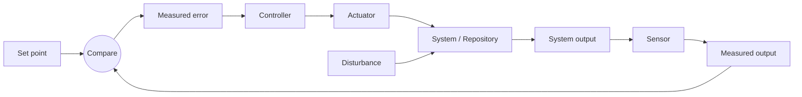

# Control Loop Taxonomy

Use this to explain an agent loop as a control system before designing one, so it is observable, bounded, and reviewable instead of "an agent runs sometimes."

Every example below is an **illustration to spark discussion**, not a recommendation. The right sensor, controller, and actuator depend entirely on the user's codebase and the tooling they already use — discover that in the interview, don't assume it.

## The four components

Foreground these four (plus the set point they serve). Keep the rest of the vocabulary in your back pocket.

- **Set point** — the desired end state for some property of the codebase. An invariant ("no module imports across these boundaries"), a threshold ("coverage ≥ 80% in `core`"), or a direction ("fewer occurrences each run").

- **Sensor** — how the loop measures the current state and the gap to the set point. It can be almost anything that reports on the codebase: a static-analysis or lint tool, a structural/AST search, a type checker, a test suite, a telemetry or error query, a code-search query, a custom script — or an agent that inspects the code. Trade-offs to talk through with the user (not rules to impose): how stable and repeatable the measurement is, how much it costs to run, and whether it can be silently disabled. Aim for output a controller can act on repeatably.

- **Controller** — how the loop turns the measurement into the next change, sized to stay low-risk and reviewable. It decides *what to do now versus defer*: which target, how many, in what order. It ranges from fully deterministic (a script that sorts findings and picks one) to fully agentic (an agent choosing from natural-language criteria), with data-driven variants in between (e.g. prioritize by where production errors cluster). This is the part you **tune over time** from loop output — start simple.

- **Actuator** — what applies the change: a coding agent (Claude Code, Codex, OpenCode, CodeLayer, …) plus a repo-local skill, running in CI and opening a PR.

- **Disturbance** — anything that changes the system from outside the loop: teammates' commits, dependency updates, generated code, flaky tests, large refactors. The loop has to make progress *despite* these.

## Components can blur

In practice — especially with agents — the lines blur, and that is fine:

- **Sensor + controller fused:** a tool that both reports problems and ranks them by impact is doing both jobs.
- **Controller + actuator fused:** a single agent prompt that both picks the next target and changes it.

Design the loop the user actually needs; don't manufacture separation that isn't there.

## The fuller picture

You rarely need to name all of this explicitly, but it helps when reasoning about a loop:

- **Measured output** — the signal the sensor produces (e.g. a list of findings, a count, a score).
- **Measured error** — the delta between set point and measured output (e.g. findings over threshold, or new findings vs a baseline).
- **Controller output** — the chosen operation for this iteration (e.g. "address these N targets in these packages").
- **System input / output** — the patch/commit/PR the actuator produces, and the resulting repo state plus validation and review.

## Run each component locally first

Whatever the components turn out to be, make each one runnable by hand and standalone before wiring CI: run the sensor and read its output, run the controller against that output, run the actuator on a selected target. The workflow should only orchestrate pieces the user can already run locally — this keeps the loop debuggable.

## Extra loop parts to consider

- **Flow control (PR bounding)** — stop scheduled runs when an open PR for this loop already exists, so the loop doesn't outrun review.
- **Dampener (regression gate)** — a check (often on PRs / pushes to main) that compares the sensor's output against a baseline so the problem can't get *worse* while the loop incrementally makes it better. Offer it; not every loop needs one.
- **Scope gate** — restrict the actuator to safe directories; exclude generated files, vendored code, or high-risk packages unless explicitly selected.
- **Batch size** — cap each run by finding/file/package count to keep diffs reviewable.
- **Memory** — durable reviewer feedback and known false positives that steer future runs (not one-off logs).

## Design questions for the interview

1. What property are we driving, and what is the set point?
2. What in this repo (or its tooling) can measure the gap repeatably? What are the trade-offs of each option?
3. What counts as an error worth acting on this run, and how big is one reviewable increment?
4. How should the controller prioritize and select targets — and how will we tune that over time?
5. Which coding agent is the actuator, what credentials does it need, and what golden patterns should it follow?
6. What validation proves the actuator improved the system?
7. What disturbances should the loop ignore, tolerate, or dampen — and do we want a regression gate?
8. What memory should carry forward between runs?
9. How do we run each component locally before it goes into CI?
