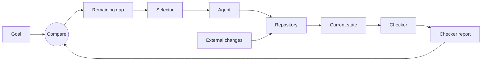

# Loop Design Guide

Use this guide to explain a recurring agent loop in plain language before designing one. The goal is to make the loop observable, bounded, and reviewable instead of merely "an agent runs sometimes."

Every example below is an **illustration to spark discussion**, not a recommendation. The right checker, selector, and agent depend entirely on the user's codebase and existing tooling. Discover them in the interview rather than assuming them.

## The core parts

Foreground these parts when talking with the user:

- **Goal** — the desired state for some property of the codebase. It can be an invariant ("no module imports across these boundaries"), a threshold ("coverage ≥ 80% in `core`"), or a direction ("fewer occurrences each run").

- **Checker** — how the loop measures the current state and the gap to the goal. It can be almost anything that reports on the codebase: a static-analysis or lint tool, a structural/AST search, a type checker, a test suite, a telemetry or error query, a code-search query, a custom script, or an agent that inspects the code. Discuss the trade-offs that matter to the user: how stable and repeatable the report is, how much it costs to run, and whether it can be silently disabled. Aim for output a selector can act on repeatably.

- **Selector** — how the loop turns the checker's report into the next change, sized to stay low-risk and reviewable. It decides *what to do now versus defer*: which target, how many, and in what order. It can be deterministic (a script that sorts findings and picks one), agentic (an agent choosing from natural-language criteria), or data-driven (for example, prioritizing where production errors cluster). This is the part to tune over time from loop output; start simple.

- **Agent** — the coding agent (Claude Code, Codex, OpenCode, CodeLayer, …) plus a repo-local skill that applies the selected change, validates it, and opens a PR.

- **External changes** — anything outside the loop that can affect its work: teammates' commits, dependency updates, generated code, flaky tests, or large refactors. The loop needs to make progress despite them.

## Parts can combine

In practice, especially with agents, these responsibilities often overlap:

- **Checker + selector:** a tool that reports problems already ranked by impact may do both jobs.
- **Selector + agent:** one agent prompt may both pick the next target and change it.

Design the loop the user actually needs. Do not manufacture separate components when one command or agent can handle multiple responsibilities clearly.

## The fuller picture

You rarely need to show all of this, but it can help when reasoning about the loop:

```mermaid
flowchart LR
  Goal --> Compare((Compare))
  Report[Checker report] --> Compare
  Compare --> Gap[Remaining gap]
  Gap --> Selector
  Selector --> Agent
  Agent --> Repository
  External[External changes] --> Repository
  Repository --> State[Current state]
  State --> Checker
  Checker --> Report
```

- **Checker report** — the findings, count, or score produced by the checker.
- **Remaining gap** — the difference between the goal and the current report, such as findings over a threshold or new findings versus a baseline.
- **Selected work** — the operation chosen for this run, such as "address these N targets in these packages."
- **Result** — the patch, commit, or PR and the resulting repository state, validation, and review.

## Run each part locally first

Make each separate part runnable by hand before wiring CI: run the checker and read its output, run the selector against that output, and run the agent on a selected target. The workflow should only orchestrate pieces the user can already run locally. This keeps the loop debuggable.

## Extra loop parts to consider

- **Flow control (PR bounding)** — stop scheduled runs when an open PR for this loop already exists, so the loop does not outrun review.
- **Regression gate** — a check (often on PRs or pushes to main) that compares the checker's output against a baseline so the problem cannot get worse while the loop incrementally improves it. Offer it; not every loop needs one.
- **Scope gate** — restrict the agent to safe directories; exclude generated files, vendored code, or high-risk packages unless explicitly selected.
- **Batch size** — cap each run by finding, file, or package count to keep diffs reviewable.
- **Memory** — durable reviewer feedback and known false positives that steer future runs, not one-off logs.

## Control-theory mapping (optional)

The skill name comes from control theory, but users do not need this vocabulary. Keep these equivalents in reserve for readers who find the formal model helpful:

- Goal = set point
- Checker = sensor
- Selector = controller
- Agent = actuator
- External changes = disturbances
- Regression gate = dampener

## Design questions for the interview

1. What property are we improving, and what is the goal?
2. What in this repo or its tooling can check the remaining gap repeatably? What are the trade-offs of each option?
3. What is worth acting on this run, and how big is one reviewable increment?
4. How should the selector prioritize targets, and how will we tune that choice over time?
5. Which coding agent will make the change, what credentials does it need, and what golden patterns should it follow?
6. What validation proves the agent improved the codebase?
7. Which external changes should the loop ignore or tolerate, and do we want a regression gate?
8. What memory should carry forward between runs?
9. How do we run each part locally before it goes into CI?
