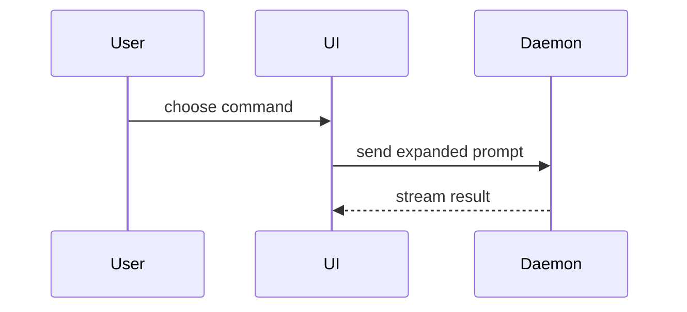

Help the user understand the current topic of conversation visually. Skip the preamble and keep prose brief. Pick the smallest view that makes the key point clear.

- Show logic or an algorithm as pseudocode:

```text
on(save)
  if content is unchanged
    return cached result
  write new content
  return fresh result
```

- Show runtime control flow as a call tree:

```text
submitForm
  createSession
    persistPrompt
    launchAgent
  navigateToSession
```

- Show UI structure as a component tree, including state and module boundaries that matter:

```tsx
<SessionPage> (apps/example/src/routes/session.tsx)
  useSessionEvents()
  <SessionToolbar>
    <RunSkillButton> (packages/ui)
```

- Show file responsibility or a broad refactor as a shallow file tree:

```text
src/
├── commands/       # parses user actions
├── sessions/       # owns session state
└── transport/      # sends API requests
```

- Show a system whose real shape is not a list — parts nested inside other parts, siblings that run in parallel, a shared layer everything draws on — as a topology, not a linear stack or tree. A stack implies a top-to-bottom order that often is not real; draw the actual containment, parallelism, and shared foundations instead. Sketch it in text, render it with a Mermaid `subgraph`, or — when filled regions and nested boxes carry the point — a focused HTML file (below):

```text
platform
  control-plane ── wraps ──┐
    seam ───────────────────┤   one contract
    brain: [ provider A │ provider B ]   ← parallel, not stacked
  services ── shared foundation every layer draws on
```

- Show component interaction, control flow, or data flow with Mermaid:



- Use `diff` when the point is what changes and the surrounding shape already exists. Match the diff shape to the topic.

For a component change:

```diff
 <SessionPage>
   useSessionEvents()
   <SessionToolbar>
+    <RunSkillButton />
   <SessionTimeline>
+    <SkillResultCard />
```

For a file-layout change:

```diff
 src/
 ├── commands/
+│   └── show-me.ts       # expands the slash command
 ├── sessions/
-└── transport.ts
+└── transport/
+    ├── client.ts
+    └── stream.ts
```

For a call-tree or call-stack change:

```diff
 submitForm
   createSession
     persistPrompt
+    expandSkillMention
     launchAgent
-  navigateToSession
+  navigateToSession
+    subscribeToEvents
```

For a state or control-flow change:

```diff
 on(save)
-  write content
+  if content is unchanged
+    return cached result
+  write new content
+  invalidate cache
```

- Show the whole block when most of it is new, when omitted context would hide ownership or order, or when the user needs a copyable target shape:

```ts
function expandSkill(command: string): string {
  const skillName = command.slice(1)
  return `use the ${skillName} skill`
}
```

- For a visual UI, layout, state comparison, or concept too dense for Mermaid, write one focused HTML file — a diagram, an infographic, or a short slide deck, whichever fits the point. Match the product's colors, type, spacing, and components; use real labels and data; support desktop and mobile. Then open it for the user:

```
Bash(open path/to/show-me-{description}.html)
```

- Use color to carry meaning, not decoration. When a view has categories — layers, modules, owners, states — give each its own hue and keep it consistent across every view on the page, so the same thing is the same color everywhere. Flat black-on-white reads as unfinished. Tree, diff, and HTML views pick up color for free; Mermaid defaults to gray, so color its nodes with `classDef` + `class` (and `style` for a `subgraph`) to match:

```
classDef svc fill:#6a4f8f,stroke:#513b6d,color:#fff;
class LogGw,ModelGw,ToolGw svc;
```

- Place each visual next to the short text it supports. Keep only the calls, files, props, states, and boundaries needed to answer the user's current question.

You may use one of these, you may use several, it is unlikely you will use all of them. Use your judgement and don't overwhelm the user.
